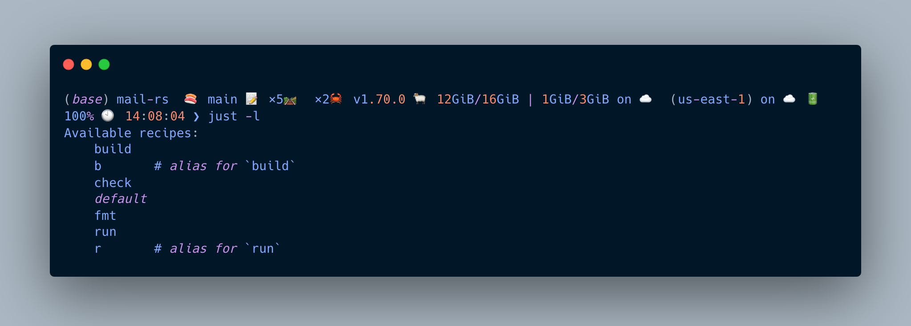
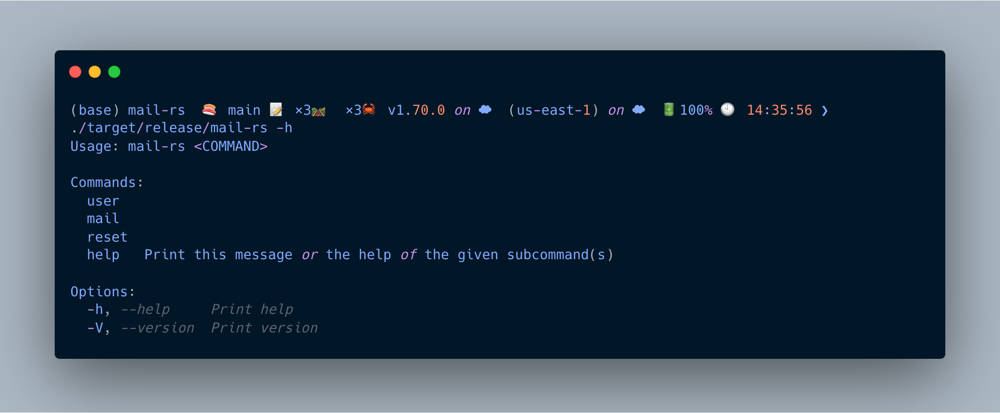
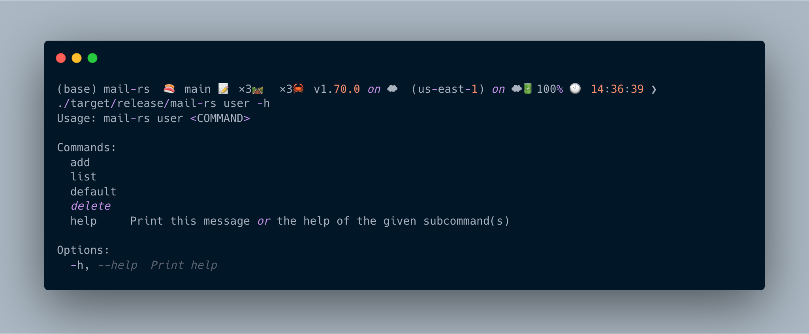
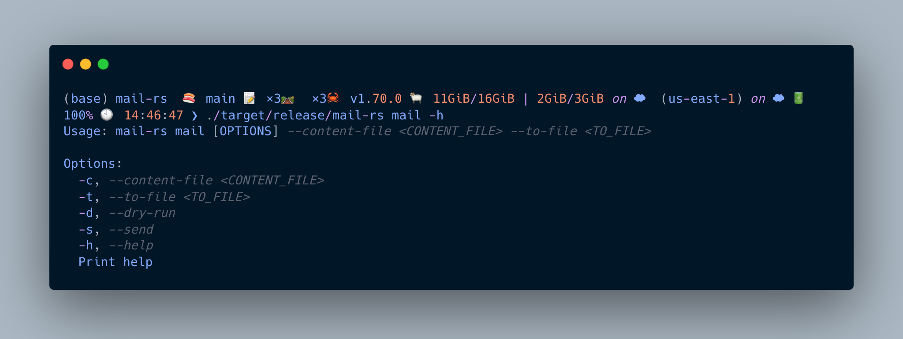

### Bulk Emailer

When you have to bulk email a bunch of people(any reason?), this script can help you do that. You can email different emails to different people via this script, and the rust template helps with that. 

So, the idea is-> 
* You create a user which is going to be used to send the emails.
    * That user is saved in the file database, using [sled](https://github.com/spacejam/sled) for this. Much like [boltdb](https://github.com/boltdb/bolt) which is an embedded K/V store for go and is much more familiar for it's wide usage in a lot of big open source projects including some from CNCF.
* You write the email content along with the subject in a .hbs file. It should be a templatised content, example attached in the repository itself at `./email.hbs`.
    * The subject has to be the first line and can contain template parameters.
    * The rest of the lines are body, can be long and can contain template parameters as well.
* You create another csv file with the list of emails and the template parameters. Example attached in the repository itself at `tos.csv` which can simply be gotten by running `cat emails.csv| awk -F ',' '{print $1 " <"  $3 ">," "\"fname="$1"\""}' | sed 1d  > tos.csv`.
    * The first line is the header, and the first column is the email address.
    * The second column contains all the template params in the format `key=value` separated by `,`.

### How to use it->
The repository doesn't ship pre built binaries... _yet_. So, you'll have to build it yourself. To build it, you will need to have rustc or cargo installed and clone this repository. 

Once you have the components required installed, the repository also ships with the `justfile` as well which can be run by the [just](https://github.com/casey/just) runner. The available just commands are-> 



Use `just b` to build the binary, use `just -l` to explore all the commands.

Once you have the binary compiled, it will reside in `./target/release` with the name of the `mail-rs`. Feel free to play with it, help is available for all the commands and sub commands.



### Steps
User Help->

* Create a user.
```sh
./target/release/mail-rs user add -f vishal -l sharma -d vishal -e vishal.sharma09890@gmail.com --provider gmail --password abcd
```
* Send mail.

```sh
./target/release/mail-rs mail -c email.hbs -t tos.csv -d
```

`-d` is for dry run and not actually send.

`-s` is to send the email actually.

`-ds` to dry run and send the email.